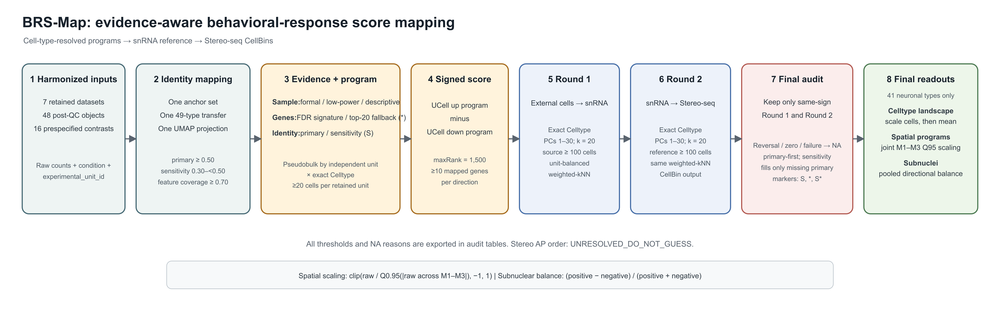

# BRS-Map

BRS-Map is an evidence-aware framework for constructing cell-type-resolved,
signed behavioral response scores from external single-cell RNA-seq datasets
and transferring those scores through a fixed snRNA-seq reference to
Stereo-seq CellBins.

## Public input boundary

BRS-Map starts from harmonized external single-cell objects that already
contain:

- raw RNA counts;
- unique cell identifiers;
- accession and object identifiers;
- condition and independent `experimental_unit_id` metadata;
- a unified 41-type `Celltype` label;
- `mapping_status` (`accepted`, `sensitivity`, or `unassigned`);
- coordinates in the frozen reference PCA space.

Raw-data download, cell calling, QC, doublet removal, and Seurat anchor
re-computation are outside this module.

## Framework

1. Aggregate cells by independent experimental unit and cell type.
2. Classify sample/statistical evidence as `formal`, `low_power`, or `descriptive`.
3. Estimate cell-type-specific differential expression.
4. Build formal or ranked-logFC fallback signed gene programs.
5. Calculate `UCell_up - UCell_down` for each eligible external cell.
6. Transfer scores to same-type snRNA-seq cells by unit-balanced weighted kNN.
7. Transfer snRNA scores to same-type Stereo-seq CellBins using the same rule.
8. Export score, uncertainty, coverage, distance, and provenance audits.

See [the full English Methods](docs/METHODS.md) and the
[workflow diagram](workflow/BRS-Map_workflow.svg). Exact settings are stored in
[`config/parameters.tsv`](config/parameters.tsv).

## Repository policy

The repository contains code, small configuration tables, tests,
documentation, and workflow artwork only. Biological data and generated result
matrices are intentionally excluded.

## Running on a server

Run `Rscript scripts/run_brs_map.R --stage preflight` first. Formal stages require explicit `--input-root`, `--output-root`, and `--adapter` arguments; no private server path is embedded. See [SERVER_QUICKSTART.md](docs/SERVER_QUICKSTART.md) and copy [server_adapter_template.R](examples/server_adapter_template.R) to a private working directory before editing I/O.

## Frozen evidence model

- Sample/statistical evidence: `formal`, `low_power`, or `descriptive`.
- Gene program: `formal_signature` or ranked-logFC `fallback`.
- Cell identity: `primary` or `sensitivity`.

The dimensions are independent and are retained in every downstream audit table.